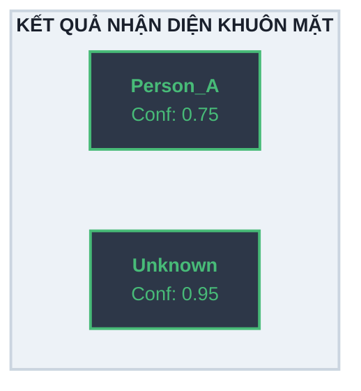
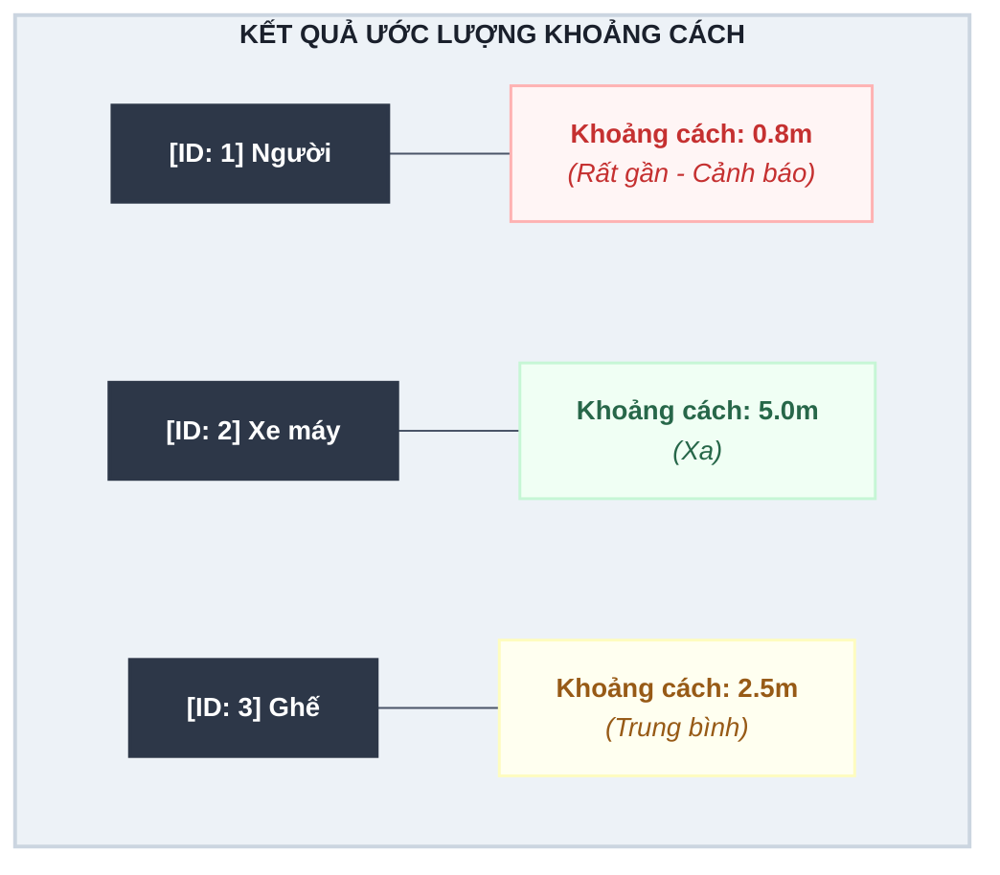

# thigiacmaytinhAnh

```mermaid
%%{init:{
'theme':'base',
'themeVariables':{
'background':'#FFFFFF',
'primaryTextColor':'#333333',
'fontFamily':'Times New Roman',
'fontSize':'14px',
'lineColor':'#4A5568'
},
'flowchart':{
'nodeSpacing': 35,
'rankSpacing': 35
}
}}%%

flowchart TB

subgraph FRAME["<b>KẾT QUẢ NHẬN DIỆN KHUÔN MẶT</b>"]
direction TB

    BOX1["<b>Person_A</b><br/>Conf: 0.75"]
    BOX2["<b>Unknown</b><br/>Conf: 0.95"]
    
    %% Tạo khoảng cách vô hình giữa 2 ô
    BOX1 ~~~ BOX2

end

classDef bbox fill:#2D3748,color:#48BB78,stroke:#48BB78,stroke-width:2px;

class BOX1,BOX2 bbox

style FRAME fill:#EDF2F7,color:#1A202C,stroke:#CBD5E0,stroke-width:2px
```

```mermaid
%%{init:{
'theme':'base',
'themeVariables':{
'background':'#FFFFFF',
'primaryTextColor':'#333333',
'fontFamily':'Times New Roman',
'fontSize':'14px',
'lineColor':'#4A5568'
},
'flowchart':{
'nodeSpacing': 15,
'rankSpacing': 15
}
}}%%

flowchart TB

subgraph FRAME["<b>KẾT QUẢ ƯỚC LƯỢNG KHOẢNG CÁCH</b>"]
direction TB

    %% Dòng 1: Người (Rất gần)
    subgraph R1[" "]
    direction LR
        BOX1["<b>[ID: 1] Người</b>"] --- INFO1["<b>Khoảng cách: 0.8m</b><br/><i>(Rất gần - Cảnh báo)</i>"]
    end

    %% Dòng 2: Xe máy (Xa)
    subgraph R2[" "]
    direction LR
        BOX2["<b>[ID: 2] Xe máy</b>"] --- INFO2["<b>Khoảng cách: 5.0m</b><br/><i>(Xa)</i>"]
    end

    %% Dòng 3: Ghế (Trung bình)
    subgraph R3[" "]
    direction LR
        BOX3["<b>[ID: 3] Ghế</b>"] --- INFO3["<b>Khoảng cách: 2.5m</b><br/><i>(Trung bình)</i>"]
    end

    R1 ~~~ R2 ~~~ R3

end

%% Style Bounding Box chính
classDef bbox fill:#2D3748,color:#FFFFFF,stroke:#2D3748,stroke-width:2px;

%% Style các thẻ thông tin khoảng cách
classDef alertClose fill:#FFF5F5,color:#C53030,stroke:#FEB2B2,stroke-width:1.5px;
classDef alertMed fill:#FFFFF0,color:#975A16,stroke:#FEFCBF,stroke-width:1.5px;
classDef alertFar fill:#F0FFF4,color:#276749,stroke:#C6F6D5,stroke-width:1.5px;

class BOX1,BOX2,BOX3 bbox
class INFO1 alertClose
class INFO2 alertFar
class INFO3 alertMed

style FRAME fill:#EDF2F7,color:#1A202C,stroke:#CBD5E0,stroke-width:2px
style R1 fill:transparent,stroke:none
style R2 fill:transparent,stroke:none
style R3 fill:transparent,stroke:none
```
