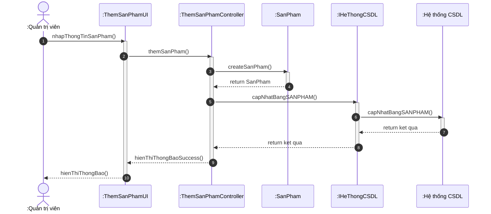

```mermaid
sequenceDiagram
    autonumber
    actor QTV as :Quản trị viên
    participant UI as :ThemSanPhamUI
    participant C as :ThemSanPhamController
    participant E as :SanPham
    participant DB_IF as :IHeThongCSDL
    participant DB as :Hệ thống CSDL

    QTV->>UI: nhapThongTinSanPham()
    activate UI
    UI->>C: themSanPham()
    activate C
    C->>E: createSanPham()
    activate E
    E-->>C: return SanPham
    deactivate E
    C->>DB_IF: capNhatBangSANPHAM()
    activate DB_IF
    DB_IF->>DB: capNhatBangSANPHAM()
    activate DB
    DB-->>DB_IF: return ket qua
    deactivate DB
    DB_IF-->>C: return ket qua
    deactivate DB_IF
    C-->>UI: hienThiThongBaoSuccess()
    deactivate C
    UI-->>QTV: hienThiThongBao()
    deactivate UI
```
