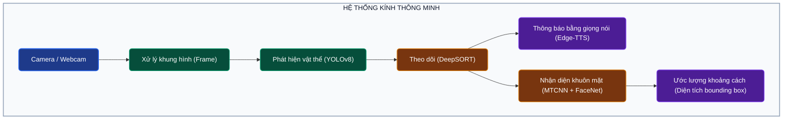

```mermaid
graph TD
    style SYSTEM fill:#f8fafc,stroke:#94a3b8,stroke-width:2px,color:#0f172a

    classDef mainApp stroke:#2563eb,stroke-width:2px,fill:#1e3a8a,color:#ffffff,rx:6px,ry:6px;
    classDef module stroke:#059669,stroke-width:1.5px,fill:#064e3b,color:#ffffff,rx:6px,ry:6px;
    classDef subModule stroke:#d97706,stroke-width:1.5px,fill:#78350f,color:#ffffff,rx:6px,ry:6px;
    classDef output stroke:#7c3aed,stroke-width:1.5px,fill:#4c1d95,color:#ffffff,rx:6px,ry:6px;

    subgraph SYSTEM ["HỆ THỐNG KÍNH THÔNG MINH"]
        A["Camera / Webcam"] --> B["Xử lý khung hình (Frame)"]
        B --> C["Phát hiện vật thể (YOLOv8)"]
        C --> D["Theo dõi (DeepSORT)"]
        
        D --> E["Thông báo bằng giọng nói (Edge-TTS)"]
        D --> F["Nhận diện khuôn mặt (MTCNN + FaceNet)"]
        F --> G["Ước lượng khoảng cách (Diện tích bounding box)"]
    end

    class A mainApp;
    class B,C module;
    class D,F subModule;
    class E,G output;
```
