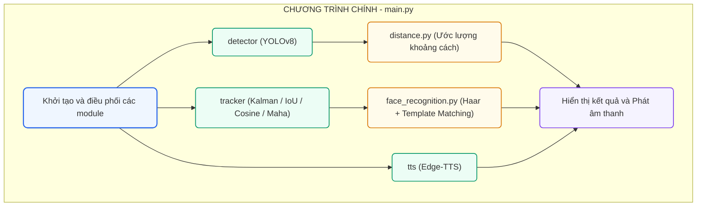

```mermaid
graph TD
    classDef mainApp stroke:#2563eb,stroke-width:2px,fill:#eff6ff,rx:8px,ry:8px;
    classDef module stroke:#059669,stroke-width:1.5px,fill:#ecfdf5,rx:6px,ry:6px;
    classDef subModule stroke:#d97706,stroke-width:1.5px,fill:#fffbeb,rx:6px,ry:6px;
    classDef output stroke:#7c3aed,stroke-width:1.5px,fill:#f5f3ff,rx:6px,ry:6px;

    subgraph MAIN ["CHƯƠNG TRÌNH CHÍNH - main.py"]
        A["Khởi tạo và điều phối các module"]

        A --> B["detector (YOLOv8)"]
        A --> C["tracker (Kalman / IoU / Cosine / Maha)"]
        A --> D["tts (Edge-TTS)"]

        B --> E["distance.py (Ước lượng khoảng cách)"]
        C --> F["face_recognition.py (Haar + Template Matching)"]

        E --> G["Hiển thị kết quả và Phát âm thanh"]
        F --> G
        D --> G
    end

    class A mainApp;
    class B,C,D module;
    class E,F subModule;
    class G output;
```
