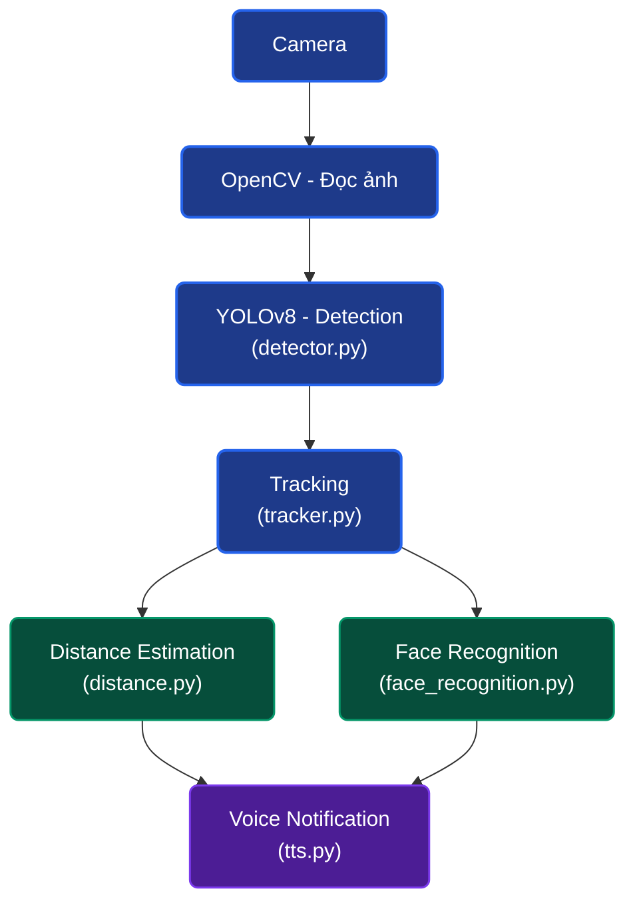

```mermaid
graph TD
    classDef step stroke:#2563eb,stroke-width:2px,fill:#1e3a8a,color:#ffffff,rx:6px,ry:6px;
    classDef subStep stroke:#059669,stroke-width:1.5px,fill:#064e3b,color:#ffffff,rx:6px,ry:6px;
    classDef output stroke:#7c3aed,stroke-width:1.5px,fill:#4c1d95,color:#ffffff,rx:6px,ry:6px;

    A["Camera"] --> B["OpenCV - Đọc ảnh"]
    B --> C["YOLOv8 - Detection<br>(detector.py)"]
    C --> D["Tracking<br>(tracker.py)"]
    
    D --> E["Distance Estimation<br>(distance.py)"]
    D --> F["Face Recognition<br>(face_recognition.py)"]
    
    E --> G["Voice Notification<br>(tts.py)"]
    F --> G

    class A,B,C,D step;
    class E,F subStep;
    class G output;
```
