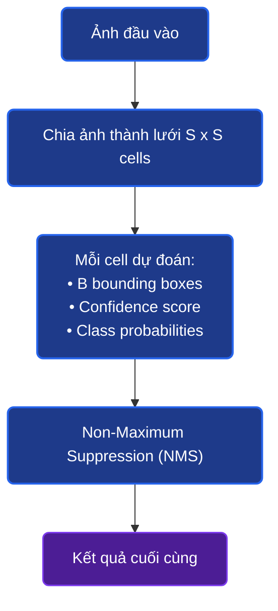

```mermaid
graph TD
    classDef step stroke:#2563eb,stroke-width:2px,fill:#1e3a8a,color:#ffffff,rx:6px,ry:6px;
    classDef output stroke:#7c3aed,stroke-width:1.5px,fill:#4c1d95,color:#ffffff,rx:6px,ry:6px;

    A["Ảnh đầu vào"] --> B["Chia ảnh thành lưới S x S cells"]
    B --> C["Mỗi cell dự đoán:<br>• B bounding boxes<br>• Confidence score<br>• Class probabilities"]
    C --> D["Non-Maximum Suppression (NMS)"]
    D --> E["Kết quả cuối cùng"]

    class A,B,C,D step;
    class E output;
```
