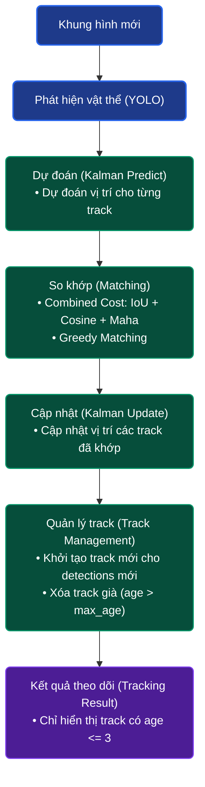

```mermaid
graph TD
    classDef step stroke:#2563eb,stroke-width:2px,fill:#1e3a8a,color:#ffffff,rx:6px,ry:6px;
    classDef process stroke:#059669,stroke-width:1.5px,fill:#064e3b,color:#ffffff,rx:6px,ry:6px;
    classDef output stroke:#7c3aed,stroke-width:1.5px,fill:#4c1d95,color:#ffffff,rx:6px,ry:6px;

    A["Khung hình mới"] --> B["Phát hiện vật thể (YOLO)"]
    B --> C["Dự đoán (Kalman Predict)<br>• Dự đoán vị trí cho từng track"]
    C --> D["So khớp (Matching)<br>• Combined Cost: IoU + Cosine + Maha<br>• Greedy Matching"]
    D --> E["Cập nhật (Kalman Update)<br>• Cập nhật vị trí các track đã khớp"]
    E --> F["Quản lý track (Track Management)<br>• Khởi tạo track mới cho detections mới<br>• Xóa track già (age > max_age)"]
    F --> G["Kết quả theo dõi (Tracking Result)<br>• Chỉ hiển thị track có age <= 3"]

    class A,B step;
    class C,D,E,F process;
    class G output;
```
