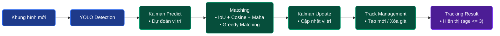

```mermaid
graph LR
    classDef step stroke:#2563eb,stroke-width:2px,fill:#1e3a8a,color:#ffffff,rx:6px,ry:6px;
    classDef process stroke:#059669,stroke-width:1.5px,fill:#064e3b,color:#ffffff,rx:6px,ry:6px;
    classDef output stroke:#7c3aed,stroke-width:1.5px,fill:#4c1d95,color:#ffffff,rx:6px,ry:6px;

    A["Khung hình mới"] --> B["YOLO Detection"]
    B --> C["Kalman Predict<br>• Dự đoán vị trí"]
    C --> D["Matching<br>• IoU + Cosine + Maha<br>• Greedy Matching"]
    D --> E["Kalman Update<br>• Cập nhật vị trí"]
    E --> F["Track Management<br>• Tạo mới / Xóa già"]
    F --> G["Tracking Result<br>• Hiển thị (age <= 3)"]

    class A,B step;
    class C,D,E,F process;
    class G output;
```
