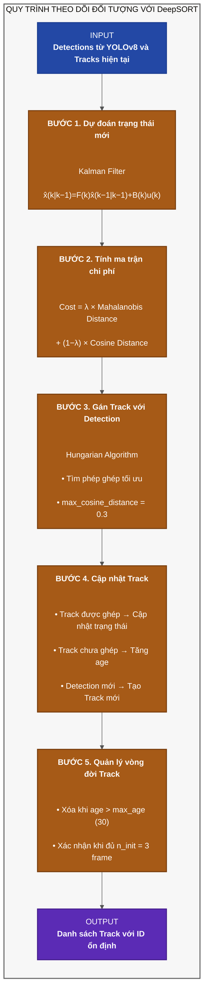

```mermaid
%%{init:{
'theme':'base',
'themeVariables':{
'background':'#FFFFFF',
'primaryTextColor':'#222222',
'fontFamily':'Times New Roman',
'fontSize':'16px',
'lineColor':'#555555'
}
}}%%

flowchart TB

subgraph MAIN["QUY TRÌNH THEO DÕI ĐỐI TƯỢNG VỚI DeepSORT"]
direction TB

A["INPUT<br/><b>Detections từ YOLOv8 và Tracks hiện tại</b>"]

B["<b>BƯỚC 1. Dự đoán trạng thái mới</b><br/><br/>
Kalman Filter<br/>
x̂(k|k−1)=F(k)x̂(k−1|k−1)+B(k)u(k)"]

C["<b>BƯỚC 2. Tính ma trận chi phí</b><br/><br/>
Cost = λ × Mahalanobis Distance<br/>
+ (1−λ) × Cosine Distance"]

D["<b>BƯỚC 3. Gán Track với Detection</b><br/><br/>
Hungarian Algorithm<br/>
• Tìm phép ghép tối ưu<br/>
• max_cosine_distance = 0.3"]

E["<b>BƯỚC 4. Cập nhật Track</b><br/><br/>
• Track được ghép → Cập nhật trạng thái<br/>
• Track chưa ghép → Tăng age<br/>
• Detection mới → Tạo Track mới"]

F["<b>BƯỚC 5. Quản lý vòng đời Track</b><br/><br/>
• Xóa khi age > max_age (30)<br/>
• Xác nhận khi đủ n_init = 3 frame"]

G["OUTPUT<br/><b>Danh sách Track với ID ổn định</b>"]

A --> B
B --> C
C --> D
D --> E
E --> F
F --> G

end

classDef input fill:#2348A5,color:#ffffff,stroke:#1B3D91,stroke-width:2px;
classDef process fill:#A65A17,color:#ffffff,stroke:#7A3F0F,stroke-width:2px;
classDef output fill:#5B2BB5,color:#ffffff,stroke:#47208F,stroke-width:2px;

class A input
class B,C,D,E,F process
class G output

style MAIN fill:#F7F7F7,stroke:#666666,stroke-width:2px
```
