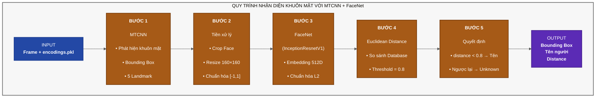

```mermaid
%%{init:{
'theme':'base',
'themeVariables':{
'background':'#FFFFFF',
'primaryTextColor':'#222222',
'fontFamily':'Times New Roman',
'fontSize':'15px',
'lineColor':'#555555'
}
}}%%

flowchart LR

subgraph MAIN["QUY TRÌNH NHẬN DIỆN KHUÔN MẶT VỚI MTCNN + FaceNet"]
direction LR

A["INPUT<br/><b>Frame + encodings.pkl</b>"]

B["<b>BƯỚC 1</b><br/>
MTCNN<br/>
• Phát hiện khuôn mặt<br/>
• Bounding Box<br/>
• 5 Landmark"]

C["<b>BƯỚC 2</b><br/>
Tiền xử lý<br/>
• Crop Face<br/>
• Resize 160×160<br/>
• Chuẩn hóa [-1,1]"]

D["<b>BƯỚC 3</b><br/>
FaceNet<br/>
(InceptionResnetV1)<br/>
• Embedding 512D<br/>
• Chuẩn hóa L2"]

E["<b>BƯỚC 4</b><br/>
Euclidean Distance<br/>
• So sánh Database<br/>
• Threshold = 0.8"]

F["<b>BƯỚC 5</b><br/>
Quyết định<br/>
• distance < 0.8 → Tên<br/>
• Ngược lại → Unknown"]

G["OUTPUT<br/><b>Bounding Box<br/>Tên người<br/>Distance</b>"]

A --> B
B --> C
C --> D
D --> E
E --> F
F --> G

end

classDef input fill:#2348A5,color:#ffffff,stroke:#1B3D91,stroke-width:2px;
classDef process fill:#A65A17,color:#ffffff,stroke:#7A3F0F,stroke-width:2px;
classDef output fill:#5B2BB5,color:#ffffff,stroke:#47208F,stroke-width:2px;

class A input
class B,C,D,E,F process
class G output

style MAIN fill:#F7F7F7,stroke:#666666,stroke-width:2px
```
