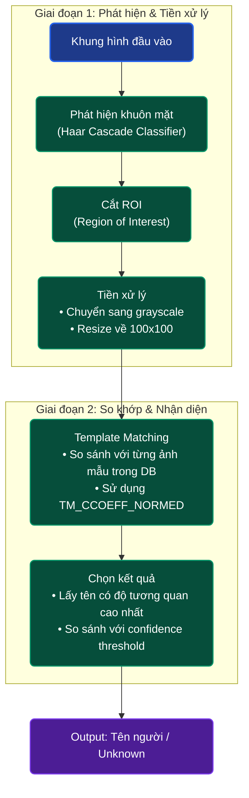

```mermaid
graph TD
    classDef step stroke:#2563eb,stroke-width:2px,fill:#1e3a8a,color:#ffffff,rx:6px,ry:6px;
    classDef process stroke:#059669,stroke-width:1.5px,fill:#064e3b,color:#ffffff,rx:6px,ry:6px;
    classDef output stroke:#7c3aed,stroke-width:1.5px,fill:#4c1d95,color:#ffffff,rx:6px,ry:6px;

    subgraph HANG1 ["Giai đoạn 1: Phát hiện & Tiền xử lý"]
        direction LR
        A["Khung hình đầu vào"] --> B["Phát hiện khuôn mặt<br>(Haar Cascade Classifier)"]
        B --> C["Cắt ROI<br>(Region of Interest)"]
        C --> D["Tiền xử lý<br>• Chuyển sang grayscale<br>• Resize về 100x100"]
    end

    subgraph HANG2 ["Giai đoạn 2: So khớp & Nhận diện"]
        direction LR
        E["Template Matching<br>• So sánh với từng ảnh mẫu trong DB<br>• Sử dụng TM_CCOEFF_NORMED"] --> F["Chọn kết quả<br>• Lấy tên có độ tương quan cao nhất<br>• So sánh với confidence threshold"]
    end

    D --> E
    F --> G["Output: Tên người / Unknown"]

    class A step;
    class B,C,D,E,F process;
    class G output;
```
