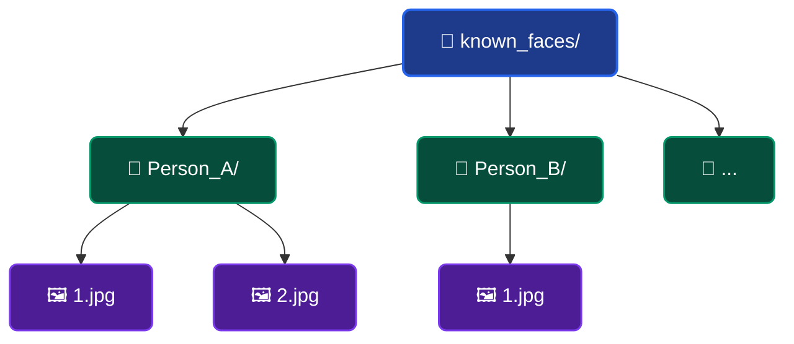

```mermaid
graph TD
    classDef root fill:#1e3a8a,stroke:#2563eb,stroke-width:2px,color:#ffffff,rx:6px,ry:6px;
    classDef folder fill:#064e3b,stroke:#059669,stroke-width:1.5px,color:#ffffff,rx:6px,ry:6px;
    classDef file fill:#4c1d95,stroke:#7c3aed,stroke-width:1.5px,color:#ffffff,rx:6px,ry:6px;

    ROOT["📁 known_faces/"]
    
    ROOT --> PA["📁 Person_A/"]
    ROOT --> PB["📁 Person_B/"]
    ROOT --> ETC["📁 ..."]

    PA --> A1["🖼️ 1.jpg"]
    PA --> A2["🖼️ 2.jpg"]
    
    PB --> B1["🖼️ 1.jpg"]

    class ROOT root;
    class PA,PB,ETC folder;
    class A1,A2,B1 file;
```
