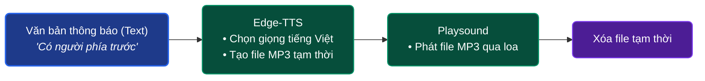

```mermaid
graph LR
    classDef step stroke:#2563eb,stroke-width:2px,fill:#1e3a8a,color:#ffffff,rx:6px,ry:6px;
    classDef process stroke:#059669,stroke-width:1.5px,fill:#064e3b,color:#ffffff,rx:6px,ry:6px;
    classDef output stroke:#7c3aed,stroke-width:1.5px,fill:#4c1d95,color:#ffffff,rx:6px,ry:6px;

    A["Văn bản thông báo (Text)<br><i>'Có người phía trước'</i>"] --> B["Edge-TTS<br>• Chọn giọng tiếng Việt<br>• Tạo file MP3 tạm thời"]
    B --> C["Playsound<br>• Phát file MP3 qua loa"]
    C --> D["Xóa file tạm thời"]

    class A step;
    class B,C process;
    class D output;
```
