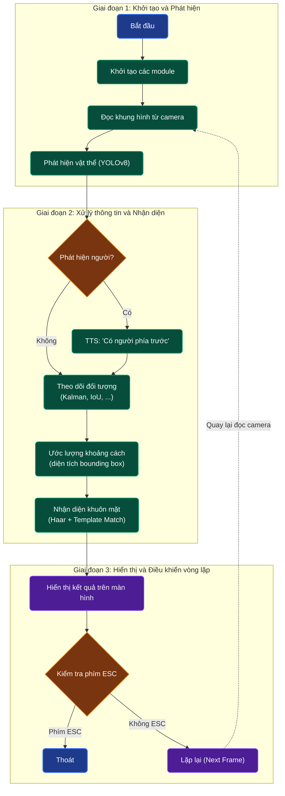

```mermaid
graph TD
    classDef start stroke:#2563eb,stroke-width:2px,fill:#1e3a8a,color:#ffffff,rx:6px,ry:6px;
    classDef process stroke:#059669,stroke-width:1.5px,fill:#064e3b,color:#ffffff,rx:6px,ry:6px;
    classDef decision stroke:#d97706,stroke-width:1.5px,fill:#78350f,color:#ffffff,rx:6px,ry:6px;
    classDef output stroke:#7c3aed,stroke-width:1.5px,fill:#4c1d95,color:#ffffff,rx:6px,ry:6px;

    subgraph PHASE1 ["Giai đoạn 1: Khởi tạo và Phát hiện"]
        direction LR
        A["Bắt đầu"] --> B["Khởi tạo các module"]
        B --> C["Đọc khung hình từ camera"]
        C --> D["Phát hiện vật thể (YOLOv8)"]
    end

    subgraph PHASE2 ["Giai đoạn 2: Xử lý thông tin và Nhận diện"]
        direction LR
        D --> E{"Phát hiện người?"}
        E -- Có --> F["TTS: 'Có người phía trước'"]
        E -- Không --> G["Theo dõi đối tượng<br>(Kalman, IoU, ...)"]
        F --> G
        G --> H["Ước lượng khoảng cách<br>(diện tích bounding box)"]
        H --> I["Nhận diện khuôn mặt<br>(Haar + Template Match)"]
    end

    subgraph PHASE3 ["Giai đoạn 3: Hiển thị và Điều khiển vòng lặp"]
        direction LR
        I --> J["Hiển thị kết quả trên màn hình"]
        J --> K{"Kiểm tra phím ESC"}
        K -- Phím ESC --> L["Thoát"]
        K -- Không ESC --> M["Lặp lại (Next Frame)"]
    end

    M -. Quay lại đọc camera .-> C

    class A,L start;
    class B,C,D,F,G,H,I process;
    class E,K decision;
    class J,M output;
```
